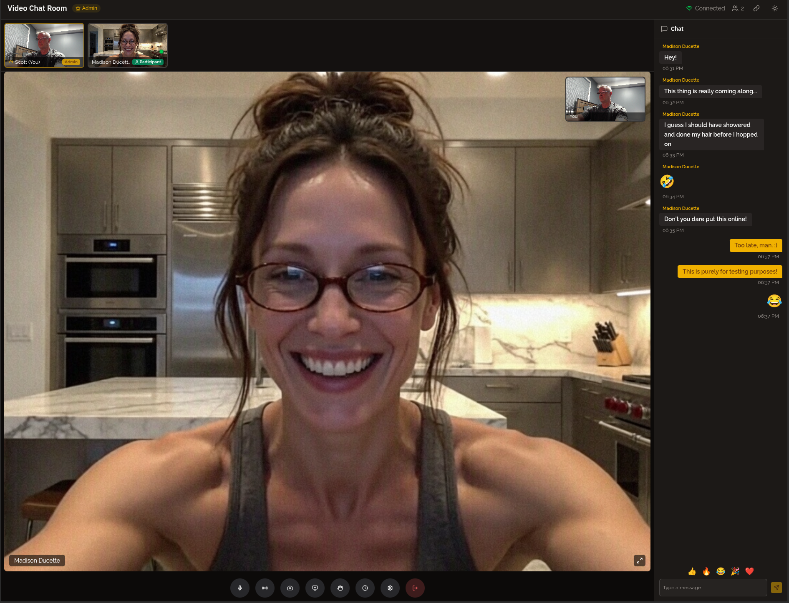

# Video Chat Room

A single-room video chat app for a small group of friends. No accounts, no sign-ups just enter a name and join.



## Features

- **Video & audio** — WebRTC mesh calling with noise suppression and echo cancellation
- **Screen sharing** — Share your screen with the group
- **Chat** — Real-time text chat with message bubbles
- **Admin controls** — First person to join becomes admin (mute, camera off, kick)
- **Auto-reconnect** — WebSocket reconnects automatically if the connection drops

## Stack

- **Frontend** — React 19, TypeScript, Vite, Tailwind CSS 4, shadcn/ui, Lucide icons
- **Backend** — FastAPI, WebSockets, MongoDB (optional)

## Quick start

```bash
# Frontend
npm install
npm run dev

# Backend (separate terminal)
cd backend

#Or Python (Depending on your system)
python3 -m venv venv
source venv/bin/activate
pip install -r requirements.txt
```


```bash
# One the above steps are complete, run the server with the following command moving forward.
python3 -m venv venv
source venv/bin/activate
python server.py
```

Open `http://localhost:5173` and enter a name to join.

## Deploy

See [DEPLOY.md](./DEPLOY.md) for full instructions on deploying the backend to Render and hosting the frontend on a static server.

## Limits

- Mesh WebRTC works well for **5–8 people**. Beyond that, quality degrades.
- No TURN server — users behind strict NATs may fail to connect.
- Chat persistence requires MongoDB. Without it, chat works in real-time but doesn't survive a restart.
